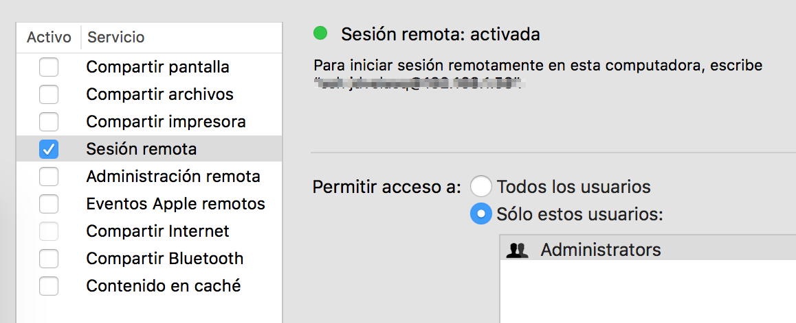

# Instalación y configuración de las herramientas en Mac OS


Esta guía describe la instalación y configuración detallada de las herramientas en MacOS.

### Paso 1

Descargue e instale Java Development Kit (JDE), versión 8. 

http://www.oracle.com/technetwork/java/javase/downloads/jdk8-downloads-2133151.html


### Paso 2

Descargue la versión más reciente de Apache Hadoop.

http://hadoop.apache.org/releases.html


### Paso 3

Habrá `Terminal`, navegue hasta el directorio de descargas y descomprima Hadoop. 
Luego renombre el directory y copielo a su directorio de usuario.

```
tar -xzf hadoop-x.y.z.tar
mv hadoop-x.y.z ~/hadoop
```

### Paso 4

Edite su archivo `.bash_profile` usando un editor de textos. Puede hacer esto desde
la línea de comandos con:

    nano ~/.bash_profile
    
Agregue los siguientes comandos (reemplazando `USERNAME` por su nombre de usuario):

```
export JAVA_HOME=$(/usr/libexec/java_home)
export HADOOP_HOME="/Users/USERNAME/hadoop"
export HADOOP_COMMON_LIB_NATIVE_DIR="$HADOOP_HOME/lib/native"
export HADOOP_OPTS="-Djava.library.path=$HADOOP_HOME/lib/native"
export HADOOP_OPTS="$HADOOP_OPTS -Djava.library.path=$HADOOP_HOME/lib"
export HADOOP_CLASSPATH=${JAVA_HOME}/lib/tools.jar
export PATH="$JAVA_HOME/bin:$HADOOP_HOME:$PATH"
```

### Paso 5

Verifique la instalación. Para ello, cierre y habra `Terminal`. Luego digite `hadoop` en la línea de comandos. Como resultado, debe imprimirse la ayuda de hadoop en la pantalla.


### Paso 6

 
Edite el archivo `etc/hadoop/core-site.xml` y agregue el siguiente contenido:

    <configuration>
        <property>
            <name>fs.defaultFS</name>
            <value>hdfs://localhost:9000</value>
        </property>
    </configuration>

Agregue el siguiente contenido al archivo `etc/hadoop/hdfs-site.xml`:

    <configuration>
        <property>
            <name>dfs.replication</name>
            <value>1</value>
        </property>
    </configuration>
    
    
### Paso 7

En **`Preferencias del sistema > Compartir`**, active la opción de Sesión Remota.



    
### Paso 8

En el prompt de comandos verifique que se puede conectar al localhost sin password, digitando:

    ssh localhost

en el Terminal. Si no se puede conectar directamente, ejecute los siguientes comandos 
en el Terminal.

```
ssh-keygen -t rsa -P '' -f ~/.ssh/id_rsa
```

```
cat ~/.ssh/id_rsa.pub >> ~/.ssh/authorized_keys
```

```
chmod 0600 ~/.ssh/authorized_keys
```


### Paso 9

Formatee el sistema de archivos de Hadoop desde el Terminal.

```
$HADOOP_HOME/bin/hdfs namenode -format
```


### Paso 10

Inicialice los servicios.

```
$HADOOP_HOME/sbin/start-dfs.sh
```


### Paso 12

Verifique que la interface a NameNode funcione correctamente. 
Abra la dirección http://localhost:9870


### Paso 13

Cree los directorios para ejecutar MapReduce

    $HADOOP_HOME/binhdfs dfs -mkdir /user
    $HADOOP_HOME/binhdfs dfs -mkdir /user/<username>
    
    
### Paso 13

Para detener los servicios ejecute

```
$HADOOP_HOME/bin/sbin/stop-dfs.sh
```


